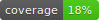

<h1 align="center">Furo50</h1>
<p align="center">
  A sphinx extenstion that turns <a href="https://github.com/pradyunsg/furo">Furo theme</a> into CS50's theme.
</p>

<p align="center">
    <a href="https://github.com/ABD-01/furo50/actions/workflows/tests.yml?branch=master">
        
    </a>
    &emsp;
    
    &emsp;
    <a href="https://github.com/psf/black">
        
    </a>
</p>

<!-- [](https://github.com/ABD-01/furo50/actions/workflows/tests.yml) &emsp;  &emsp; [](https://github.com/psf/black) -->


See \#TODO for more details.

## Quickstart

To use this extension you will need [Furo](https://pradyunsg.me/furo/) theme for your project. 

1. Install Furo50 extension in your sphinx environment.

```
pip install furo50
```

2. 
Update the html_theme in conf.py.

html_theme = "furo"
Your Sphinx documentation’s HTML pages will now be generated with this theme! 🎉


## Usage

To use this extension your sphinx theme must be [furo](https://pradyunsg.me/furo/).

In your [`conf.py`](https://www.sphinx-doc.org/en/master/usage/configuration.html) configuration file, add `furo50` to your extensions list. E.g.:
```python
html_theme = 'furo'
extensions = [
    ...
    'furo50'
    ...
]
```

## Features
\#TODO

## Acknowledgements
\#TODO

## Changelog
\#TODO

## Licence
Copyright © 2024, Muhammed Abdullah

This software is made available under the GPL v3.